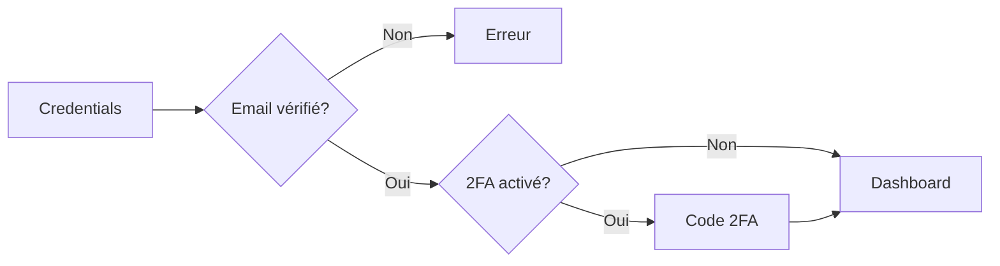

## Sécurité Implémentée

<CardGroup cols={3}>
  <Card title="Email Verification" icon="envelope-circle-check">
    Confirmation obligatoire par lien
  </Card>
  <Card title="2FA (TOTP)" icon="mobile-screen">
    Authentification à deux facteurs
  </Card>
  <Card title="ReCAPTCHA v3" icon="robot">
    Protection anti-bot
  </Card>
</CardGroup>

## Processus d'Inscription

<Steps>
  <Step title="Formulaire">
    Saisie nom, email, mot de passe
  </Step>
  <Step title="Validation">
    Vérification ReCAPTCHA
  </Step>
  <Step title="Email">
    Envoi lien de confirmation (24h)
  </Step>
  <Step title="Activation">
    Clic sur lien active le compte
  </Step>
</Steps>

[Screenshot: Interface d'inscription]

[Screenshot: Email de vérification]

## Processus de Connexion

[Screenshot: Interface de connexion]

[Screenshot: Saisie code 2FA]

## Authentification 2FA

<Steps>
  <Step title="Activation">
    Activer la vérification à deux facteurs depuis le profil utilisateur.
  </Step>

  <Step title="Envoi du code">
    Un code de sécurité à usage unique est envoyé automatiquement par email.
  </Step>

  <Step title="Validation">
    L’utilisateur saisit le code reçu pour confirmer l’opération.
  </Step>

  <Step title="Expiration">
    Le code envoyé par email expire automatiquement après 5 minutes.
  </Step>

  <Step title="Codes de récupération">
    Des codes de récupération à usage unique sont générés et peuvent être utilisés en cas d’accès indisponible à l’email.
  </Step>
</Steps>

[Screenshot: Configuration 2FA]

[Screenshot: Codes de récupération]

## Gestion du Profil

<Tabs>
  <Tab title="Informations">
    Nom, email, téléphone, photo
  </Tab>
  <Tab title="Préférences">
    Langue, notifications, thème
  </Tab>
  <Tab title="Sécurité">
    2FA, sessions actives, historique
  </Tab>
</Tabs>

[Screenshot: Page profil]

[Screenshot: Gestion préférences]

