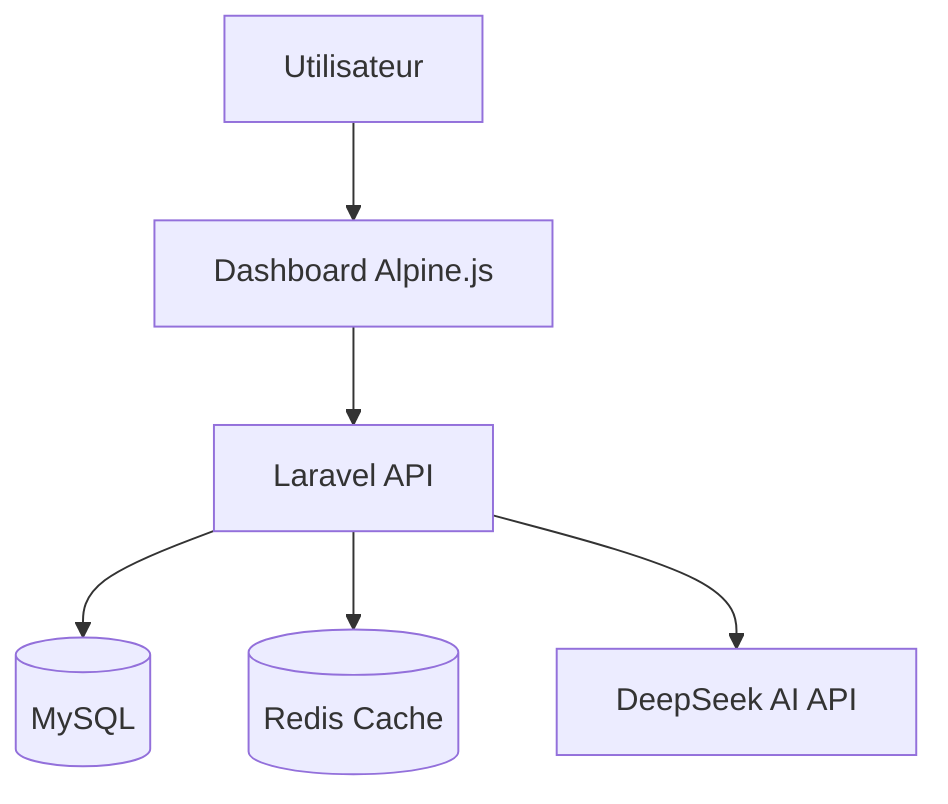
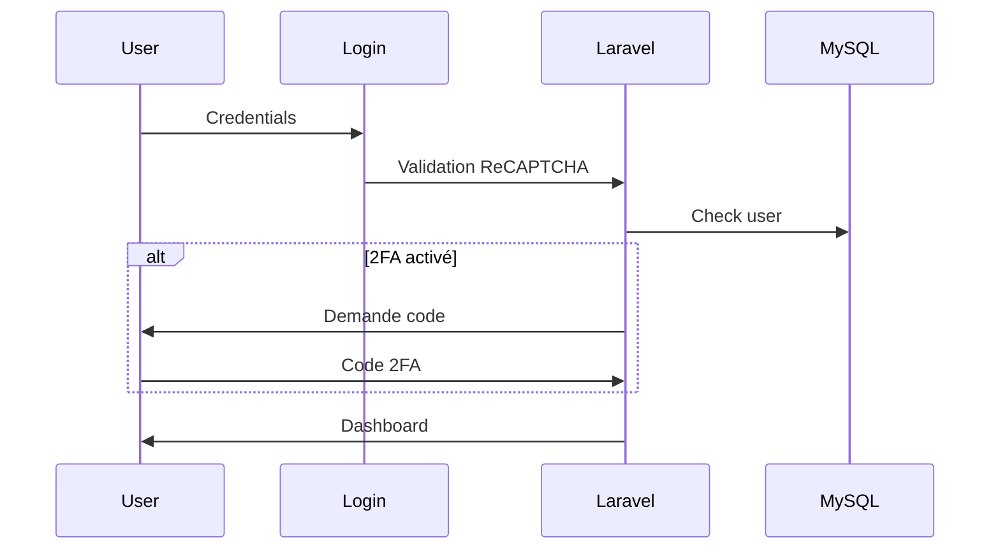
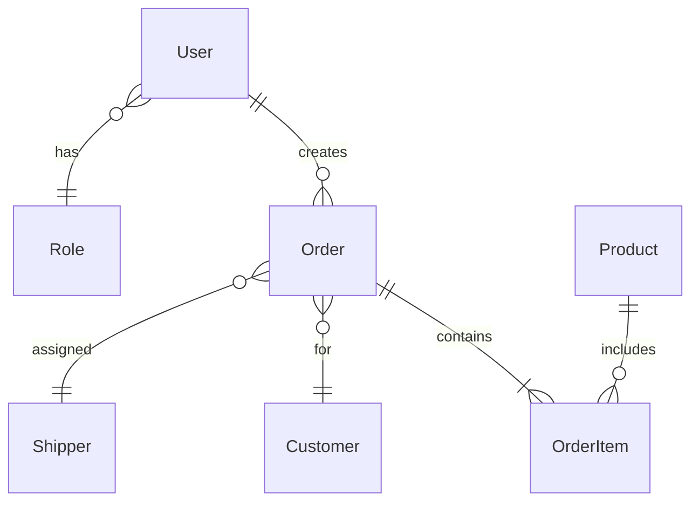

## Architecture Globale

## Flux d'Authentification

## Structure Modulaire

<CardGroup cols={2}>
  <Card title="Core Métier" icon="cube">
    Produits, Commandes, Clients, Fournisseurs
  </Card>
  <Card title="Logistique" icon="truck">
    Livreurs, Tarifs, Bons, Suivi
  </Card>
  <Card title="Finance" icon="coins">
    Facturation, Dépenses, Profit
  </Card>
  <Card title="Marketing" icon="bullhorn">
    Media Buyers, Campagnes, KPIs
  </Card>
</CardGroup>

## Modèle de Données

## Permissions par Rôle

| Module | Admin | Moderator | Employee | Media Buyer | Shipper |
|--------|-------|-----------|----------|-------------|---------|
| Produits | ✅ | ✅ | ✅ | ❌ | ❌ |
| Commandes | ✅ | ✅ | ✅ | ❌ | ✅ |
| Media | ✅ | ❌ | ❌ | ✅ | ❌ |
| Finance | ✅ | ✅ | ❌ | ❌ | ❌ |
| Paramètres | ✅ | ❌ | ❌ | ❌ | ❌ |

