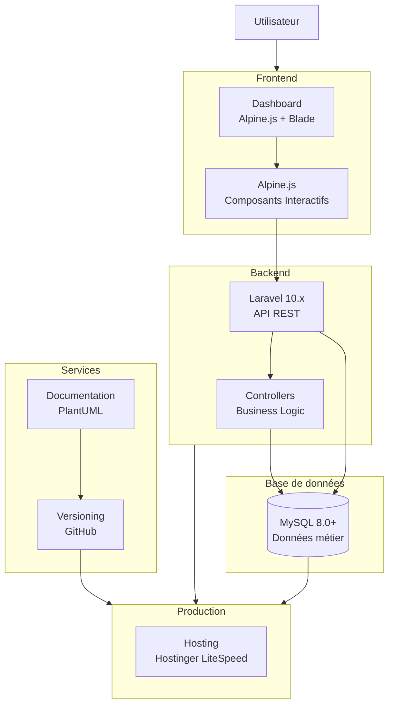
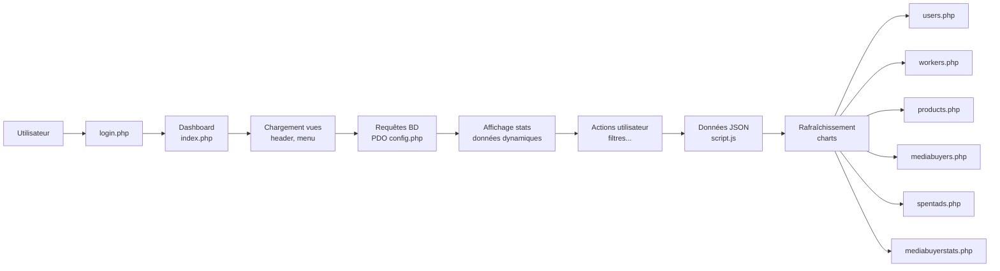

import { Card, CardGroup } from '@mintlify/components';

# Gecommerce CRM Platform

Plateforme CRM e-commerce nouvelle génération développée par **Alloleadsolutions**, combinant l'IA DeepSeek, la gestion logistique complète et l'analytics prédictif.

<CardGroup cols={2}>
  <Card title="Démarrage rapide" icon="rocket" href="/getting-started">
    Installez et configurez Gecommerce en 5 minutes
  </Card>
  <Card title="Documentation API" icon="code" href="/api-reference">
    Intégrez Gecommerce à vos systèmes existants
  </Card>
  <Card title="Démo Live" icon="play" href="https://demo.gecommerce.com">
    Testez la plateforme en ligne
  </Card>
  <Card title="Support" icon="life-ring" href="/support">
    Obtenez de l'aide de notre équipe
  </Card>
</CardGroup>

## Fonctionnalités principales

<CardGroup cols={2}>
  <Card title="IA Intégrée" icon="brain">
    Assistant intelligent basé sur DeepSeek pour l'analyse prédictive et les recommandations automatisées
  </Card>
  <Card title="Gestion Logistique" icon="truck">
    Suivi complet des livraisons, gestion des livreurs et calcul automatique des frais
  </Card>
  <Card title="Analytics Temps Réel" icon="chart-line">
    KPIs avancés (CPC, CPL, ROAS) avec prédictions de performance
  </Card>
  <Card title="Sécurité Enterprise" icon="shield-halved">
    2FA, vérification email, ReCAPTCHA et permissions granulaires
  </Card>
  <Card title="Multi-boutiques" icon="store">
    Gérez plusieurs boutiques depuis une interface unique
  </Card>
  <Card title="Gestion Stock" icon="boxes-stacked">
    Alertes automatiques, mouvements de stock et inventaire en temps réel
  </Card>
</CardGroup>

## Architecture Technique

### Vue d'ensemble du système



### Architecture Fonctionnelle



### Stack Technique

<CardGroup cols={3}>
  <Card title="Backend" icon="server">
    **Framework**: Laravel 10.x (PHP 8.2+)
    
    **ORM**: Eloquent
    
    **Auth**: Sanctum + 2FA
    
    **Queue**: Redis
  </Card>
  <Card title="Frontend" icon="window">
    **JS Framework**: Alpine.js 3.x
    
    **CSS**: Tailwind CSS 3.x
    
    **Charts**: Chart.js
    
    **Template**: Blade
  </Card>
  <Card title="Infrastructure" icon="database">
    **Database**: MySQL 8.0+
    
    **Cache**: Redis 7.x
    
    **Hosting**: Hostinger
    
    **Monitor**: Telescope
  </Card>
</CardGroup>

## Flux de données

### Authentification et Dashboard

<Steps>
  <Step title="Authentification utilisateur">
    L'utilisateur accède à `login.php` avec ses identifiants (email + 2FA si activé)
  </Step>
  <Step title="Chargement du Dashboard">
    Redirection vers `index.php` avec chargement des vues (header, menu, sidebar)
  </Step>
  <Step title="Requêtes base de données">
    Exécution des requêtes PDO via `config.php` pour récupérer les données
  </Step>
  <Step title="Affichage dynamique">
    Affichage des statistiques et données en temps réel selon le rôle utilisateur
  </Step>
  <Step title="Interactions utilisateur">
    Actions (filtres, recherches) déclenchent des requêtes AJAX via `script.js`
  </Step>
  <Step title="Mise à jour temps réel">
    Rafraîchissement automatique des charts et tableaux sans rechargement de page
  </Step>
</Steps>

### Modules principaux

Les données sont réparties dans 6 modules PHP distincts :

<AccordionGroup>
  <Accordion title="users.php - Gestion Utilisateurs" icon="users">
    CRUD complet des utilisateurs, gestion des rôles (Admin, Moderator, Employee, Media Buyer, Shipper, Sub-Shipper), permissions granulaires, logs d'activité
  </Accordion>
  <Accordion title="workers.php - Gestion Employés" icon="user-tie">
    Gestion des employés et sous-traitants, assignation aux boutiques, suivi des performances, gestion des horaires
  </Accordion>
  <Accordion title="products.php - Catalogue Produits" icon="box">
    CRUD produits avec variants, gestion stock et alertes, catégories et fournisseurs, prix et promotions, import/export Excel
  </Accordion>
  <Accordion title="mediabuyers.php - Media Buyers" icon="bullhorn">
    Gestion des acheteurs média, campagnes publicitaires, budgets et dépenses, tracking des conversions, calcul ROI
  </Accordion>
  <Accordion title="spentads.php - Dépenses Publicitaires" icon="dollar-sign">
    Suivi détaillé des dépenses par campagne, calcul CPC/CPL/CPD, comparaison budgets vs réalisé, rapports financiers
  </Accordion>
  <Accordion title="mediabuyerstats.php - Statistiques Media Buying" icon="chart-pie">
    Analytics avancés des performances, tableaux de bord personnalisés, KPIs en temps réel, prédictions IA, export rapports
  </Accordion>
</AccordionGroup>

## Installation rapide

<Steps>
  <Step title="Cloner le projet">
    ```bash
    git clone https://github.com/alloleadsolutions/gecommerce.git
    cd gecommerce
    ```
  </Step>
  <Step title="Installer les dépendances">
    ```bash
    composer install
    npm install && npm run build
    ```
  </Step>
  <Step title="Configurer l'environnement">
    ```bash
    cp .env.example .env
    php artisan key:generate
    ```
    
    Éditez `.env` avec vos credentials MySQL et API DeepSeek
  </Step>
  <Step title="Initialiser la base de données">
    ```bash
    php artisan migrate --seed
    php artisan make:admin
    ```
  </Step>
  <Step title="Lancer l'application">
    ```bash
    php artisan serve
    npm run dev
    ```
    
    Accès : `http://localhost:8000`
    
    Credentials : `admin@gecommerce.com` / `password`
  </Step>
</Steps>

## Configuration Production

### Déploiement sur Hostinger

<Steps>
  <Step title="Préparer l'application">
    ```bash
    npm run production
    php artisan config:cache
    php artisan route:cache
    php artisan view:cache
    ```
  </Step>
  <Step title="Optimiser les performances">
    ```bash
    composer install --optimize-autoloader --no-dev
    php artisan optimize
    ```
  </Step>
  <Step title="Configurer le serveur">
    Assurez-vous que le serveur Hostinger pointe vers le dossier `/public`
    
    Configurez LiteSpeed pour Laravel (fichiers `.htaccess` inclus)
  </Step>
  <Step title="Variables d'environnement">
    Configurez les variables dans le panel Hostinger ou via `.env` en production
    
    **Important** : `APP_ENV=production` et `APP_DEBUG=false`
  </Step>
</Steps>

## API Reference

### Authentification

```bash
POST /api/v1/auth/login
Content-Type: application/json
```

```json
{
  "email": "admin@gecommerce.com",
  "password": "password",
  "device_name": "web_app"
}
```

**Réponse**:
```json
{
  "token": "eyJhbGciOiJIUzI1NiIsInR5cCI6IkpXVCJ9...",
  "user": {
    "id": 1,
    "name": "Admin",
    "email": "admin@gecommerce.com",
    "role": "admin"
  }
}
```

### Endpoints principaux

<CardGroup cols={2}>
  <Card title="Produits" icon="box">
    `GET /api/v1/products`
    
    `POST /api/v1/products`
    
    `GET /api/v1/products/{id}`
    
    `PUT /api/v1/products/{id}`
    
    `DELETE /api/v1/products/{id}`
  </Card>
  <Card title="Commandes" icon="cart-shopping">
    `GET /api/v1/orders`
    
    `POST /api/v1/orders`
    
    `GET /api/v1/orders/{id}`
    
    `PUT /api/v1/orders/{id}/status`
    
    `POST /api/v1/orders/{id}/invoice`
  </Card>
  <Card title="Analytics" icon="chart-simple">
    `GET /api/v1/analytics/sales`
    
    `GET /api/v1/analytics/products/top`
    
    `GET /api/v1/analytics/customers`
    
    `POST /api/v1/analytics/predict`
    
    `GET /api/v1/reports/{type}`
  </Card>
  <Card title="Intelligence IA" icon="brain">
    `POST /api/v1/ai/chat`
    
    `POST /api/v1/ai/analyze`
    
    `POST /api/v1/ai/predict`
    
    `GET /api/v1/ai/recommendations`
  </Card>
</CardGroup>

### Exemple : Créer un produit

```bash
POST /api/v1/products
Authorization: Bearer {token}
Content-Type: application/json
```

```json
{
  "name": "iPhone 15 Pro",
  "sku": "IPH15PRO-256",
  "price": 1299.99,
  "cost_price": 899.00,
  "stock_quantity": 50,
  "min_stock": 10,
  "category_id": 1,
  "shop_id": 1,
  "description": "Dernier iPhone avec puce A17 Pro"
}
```

## Gestion des rôles

### Rôles disponibles

<CardGroup cols={3}>
  <Card title="Admin" icon="crown">
    Accès complet à toutes les fonctionnalités
    
    Gestion utilisateurs et boutiques
    
    Configuration système
  </Card>
  <Card title="Moderator" icon="shield">
    Gestion contenus et commandes
    
    Support clients
    
    Modération avis
  </Card>
  <Card title="Employee" icon="user">
    Gestion quotidienne
    
    Traitement commandes
    
    Gestion stock
  </Card>
  <Card title="Media Buyer" icon="bullhorn">
    Création campagnes
    
    Suivi performances
    
    Analytics marketing
  </Card>
  <Card title="Shipper" icon="truck">
    Gestion livraisons
    
    Bons d'expédition
    
    Suivi colis
  </Card>
  <Card title="Sub-Shipper" icon="truck-fast">
    Livraisons assignées
    
    Scan colis
    
    Confirmation livraisons
  </Card>
</CardGroup>

### Matrice des permissions

```php
// config/roles.php
return [
    'admin' => [
        'users', 'products', 'orders', 'analytics', 
        'settings', 'shops', 'media_buying', 'shipping'
    ],
    'moderator' => [
        'products', 'orders', 'customers', 'content'
    ],
    'employee' => [
        'products', 'orders', 'stock'
    ],
    'media_buyer' => [
        'campaigns', 'analytics', 'spent_ads'
    ],
    'shipper' => [
        'orders', 'shipping', 'delivery_notes'
    ],
    'sub_shipper' => [
        'assigned_deliveries', 'scan_packages'
    ]
];
```

## Module IA DeepSeek

### Chatbot intelligent

```javascript
// Exemple d'utilisation du chatbot IA
async function askAI(question) {
  const response = await fetch('/api/v1/ai/chat', {
    method: 'POST',
    headers: {
      'Authorization': `Bearer ${token}`,
      'Content-Type': 'application/json'
    },
    body: JSON.stringify({
      question: question,
      context: {
        module: 'products',
        user_role: 'admin'
      }
    })
  });
  
  return await response.json();
}

// Exemple de question
const result = await askAI(
  "Quels sont les produits les plus vendus ce mois-ci ?"
);
```

### Analyse prédictive

```php
// Prédiction des ventes futures
use App\Services\DeepSeekService;

$deepseek = new DeepSeekService();

$prediction = $deepseek->predictSales([
    'product_id' => 123,
    'days_ahead' => 30,
    'include_seasonality' => true
]);

// Résultat
[
    'predicted_sales' => 450,
    'confidence' => 0.87,
    'recommendations' => [
        'Augmenter le stock de 20%',
        'Lancer une promotion dans 2 semaines'
    ]
]
```

## Roadmap

<Steps>
  <Step title="Q2 2025">
    **API Marketplaces**: Intégration Amazon, eBay, Cdiscount
    
    **Application mobile**: React Native iOS/Android
    
    **Paiements**: Stripe, PayPal, Lyra
    
    **WhatsApp Commerce**: API WhatsApp Business
  </Step>
  <Step title="Q3 2025">
    **Marketplace**: Plateforme inter-commerçants
    
    **Dropshipping**: Gestion automatisée fournisseurs
    
    **ERP Connect**: Intégration Sage, SAP, Odoo
    
    **Blockchain**: Traçabilité et authenticité produits
  </Step>
  <Step title="Q4 2025">
    **IA Avancée**: Computer Vision pour catégorisation produits
    
    **Voice Commerce**: Commandes et recherches vocales
    
    **AR/VR**: Visualisation 3D et essais virtuels
    
    **Web3**: Paiements crypto et NFTs
  </Step>
</Steps>

## Support & Communauté

<CardGroup cols={2}>
  <Card title="Documentation" icon="book" href="/docs">
    **Guides complets**: Installation, configuration, utilisation
    
    **Tutoriels vidéos**: Screencasts détaillés
    
    **FAQ technique**: Réponses aux questions fréquentes
  </Card>
  <Card title="Support Enterprise" icon="headset" href="/support">
    **Support prioritaire**: Réponse sous 2h ouvrées
    
    **Consulting**: Accompagnement personnalisé
    
    **Formation**: Sessions en présentiel ou visio
  </Card>
  <Card title="Communauté" icon="users" href="https://discord.gg/gecommerce">
    **Forum**: Échanges entre utilisateurs
    
    **Discord**: Support communautaire 24/7
    
    **GitHub**: Issues, contributions, pull requests
  </Card>
  <Card title="Contact" icon="envelope" href="mailto:support@gecommerce.com">
    **Email**: support@gecommerce.com
    
    **Téléphone**: +212 XXX XXX XXX
    
    **Adresse**: Quartier El Farah, Agadir – Maroc
  </Card>
</CardGroup>

---

<Info>
**Gecommerce CRM Platform** - Open source sous licence MIT

Développé avec par **Alloleadsolutions SARL AU**

📍 N°130, Bloc 25, Avenue Mimosa, Quartier El Farah, Agadir – Maroc

🌐 https://gecommerce.com
</Info>